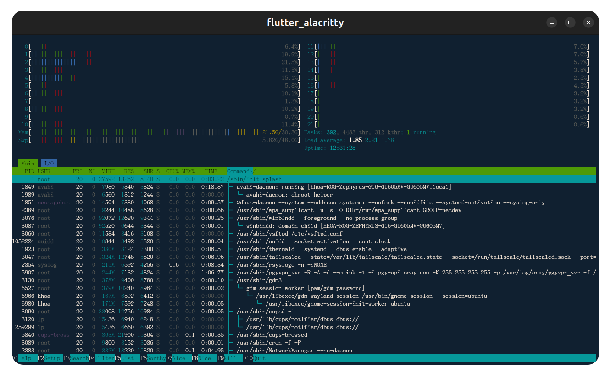

# flutter_alacritty

Flutter terminal widget powered by an [Alacritty](https://github.com/alacritty/alacritty)-based Rust engine, with PTY support via [`flutter_pty`](https://pub.dev/packages/flutter_pty).

## Screenshots



## Requirements

- Flutter 3.3+
- Dart 3.11+
- Rust toolchain (for building the native engine)
- Linux, macOS, or Windows desktop (primary targets)

## Use as a dependency

```yaml
dependencies:
  flutter_alacritty: ^1.0.0
```

```dart
import 'package:flutter/material.dart';
import 'package:flutter_alacritty/flutter_alacritty.dart';
import 'package:flutter_alacritty/src/rust/frb_generated.dart';

Future<void> main() async {
  WidgetsFlutterBinding.ensureInitialized();
  await RustLib.init();
  runApp(
    MaterialApp(
      home: TerminalScreen(
        title: ValueNotifier('my app'),
        config: const TerminalConfig(),
      ),
    ),
  );
}
```

Initialize `RustLib` once before using the terminal. See `lib/main.dart` in this repo for a full demo app.

## Clone (with Rust FFI submodule)

```bash
git clone --recurse-submodules https://github.com/hhoao/flutter_alacritty.git
# existing clone:
git submodule update --init --recursive
```

The [`rust_lib_flutter_alacritty`](https://github.com/hhoao/rust_lib_flutter_alacritty) plugin lives in `packages/rust_lib_flutter_alacritty/` as a git submodule.

## Package Linux (deb + AppImage)

See [linux/packaging/README.md](linux/packaging/README.md) for detailed steps. Briefly:

```bash
dart pub global activate fastforge
git submodule update --init --recursive
flutter pub get
fastforge release --name dev
# Output: dist/{version}/flutter_alacritty-{version}-linux.deb, etc.
```

## Run the demo app (from git checkout)

```bash
flutter pub get
flutter run -d linux   # or macos / windows
```

## Publishing to pub.dev

This repo ships **two** packages:

| Package | Directory | Publish first? |
|---------|-----------|----------------|
| `rust_lib_flutter_alacritty` | [`packages/rust_lib_flutter_alacritty/`](https://github.com/hhoao/rust_lib_flutter_alacritty) (submodule) | **Yes** |
| `flutter_alacritty` | repo root | After the plugin is on pub.dev |

See [PUBLISHING.md](PUBLISHING.md) for the full checklist.

## License

MIT — see [LICENSE](LICENSE).
